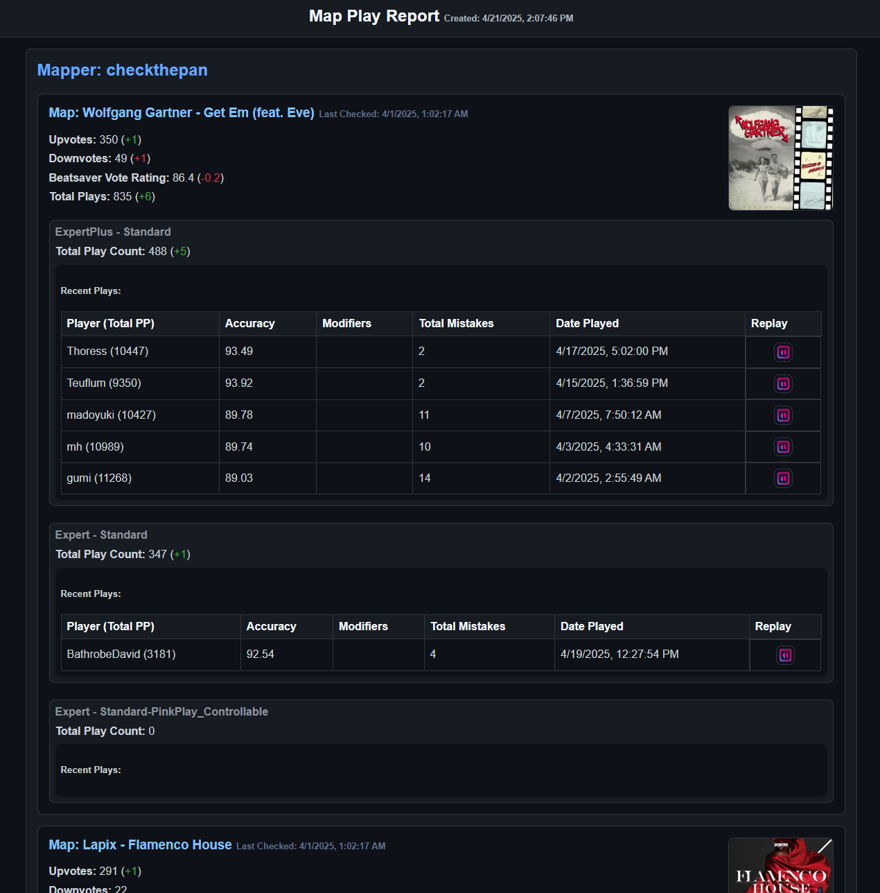

# check-map-plays

A Node.js application that tracks play statistics for your Beat Saber custom maps. It combines data from BeatSaver and BeatLeader to generate comprehensive reports about your maps' performance over time.



## Features

- Tracks upvotes, downvotes in addition to play data across difficulties
- Displays recent plays with player information and replay links
- Run as a server to view on any device/browser or run locally (HTML will be generated and opened)
- Can track multiple mappers

## Prerequisites

- Node.js 18 or later

## Installation

1. Clone this repository:
   ```bash
   git clone https://github.com/bradyep/check-bs-map-plays.git
   cd check-bs-map-plays
   ```

2. Install dependencies:
   ```bash
   npm install
   ```

3. Build the project:
   ```bash
   npm run build
   ```

## Usage

1. Start off by running locally which will ask you for your BeatSaver mapperId:
   ```bash
   npm start
   ```

2. That will create a JSON file that will let you run the application as a server:
   ```bash
   npm run server
   ```

The server can then be accessed at [http://localhost:3000/report](http://localhost:3000/report).

You can track more mappers by adding mapperIds to the `mapperIdsToTrack` property in the generated `map-play-report.json` file. 

### Running in Docker

You can run this within a Docker container with this command:

`docker run -d -p 3000:3000 check-map-plays`

Note that you will still have to run `npm start` to set the mapperId from the command line from within the container before viewing reports from the server. 

`docker exec -it containername /bin/bash`

## Limitations

- Due to API limitations, this tool can only process up to 100 maps per mapper
- In order to not hit any API too hard, this application will supply cached data if you request a report less than 15 minutes from the last time

## License

This project is licensed under the Apache License - see the LICENSE file for details.
